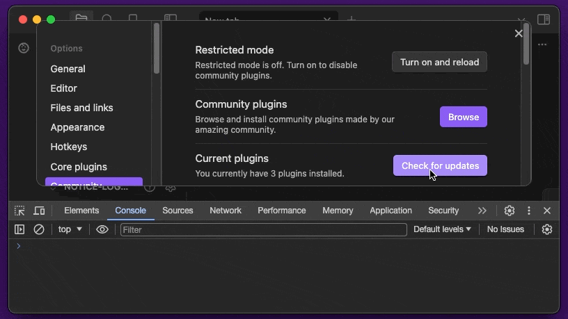
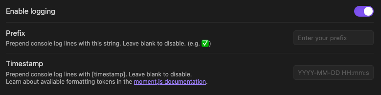

# Notice Logger

An [Obsidian.md](https://obsidian.md) plugin for logging all notices to the developer console, with optional prefix and timestamp.

## Demo

## Settings tab

## Commands

Available commands to quickly enable/disable logging to the developer console.

- Enable notice logging
- Disable notice logging

## Installation

### Community plugins

1. [Obsidian.md/plugins](https://obsidian.md/plugins?id=notice-logger) or
2. Open *Settings* > *Community Plugins* > *Browse*
3. Search for "Notice logger"

### via BRAT (Beta Reviewer's Auto-update Tool)

1. Ensure [BRAT](https://github.com/TfTHacker/obsidian42-brat) is installed
2. Trigger the command `Obsidian42 - BRAT: Add a beta plugin for testing`
3. Enter this repository, `gapmiss/notice-logger`
4. Enable _Livecodes_ plugin in community plugin list

### Manually

1. download `main.js`, `manifest.json` from the latest [release](https://github.com/gapmiss/notice-logger/releases/)
2. create a new folder `/path/to/vault/.obsidian/plugins/notice-logger`
3. move `main.js` & `manifest.json` to `/path/to/vault/.obsidian/plugins/notice-logger`
4. Settings > Community plugins > reload **Installed plugins**
5. enable plugin

## ROADMAP

- [X] add timestamp option
- [X] add commands to stop/start logging
