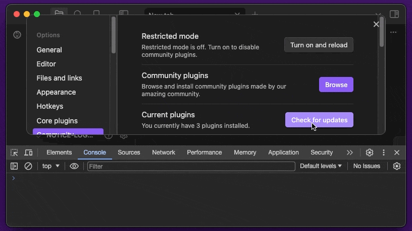
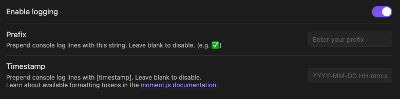

# Notice Logger

An [Obsidian.md](https://obsidian.md) plugin for logging all notices to the developer console, with optional prefix and timestamp.

## Installation

[Install from community.obsidian.md](https://community.obsidian.md/plugins/notice-logger)

From Obsidian's settings or preferences:

1. Community Plugins > Browse
2. Search for "Notice Logger"

Manually:

1. download the latest [release](https://github.com/gapmiss/notice-logger/releases/latest) archive
2. uncompress the downloaded archive
3. move the `notice-logger` folder to `/path/to/vault/.obsidian/plugins/` 
4.  Settings > Community plugins > reload **Installed plugins**
5.  enable plugin

or:

1.  download `main.js`, `manifest.json` & `styles.css` from the latest [release](https://github.com/gapmiss/notice-logger/releases/latest)
2.  create a new folder `/path/to/vault/.obsidian/plugins/notice-logger`
3.  move all 3 files to `/path/to/vault/.obsidian/plugins/notice-logger`
4.  Settings > Community plugins > reload **Installed plugins**
5.  enable plugin

## Demo

## Settings tab

## Commands

Available commands to quickly enable/disable logging to the developer console.

- Enable notice logging
- Disable notice logging

